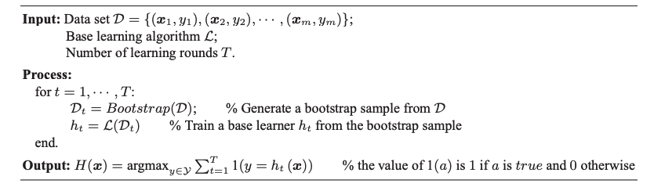
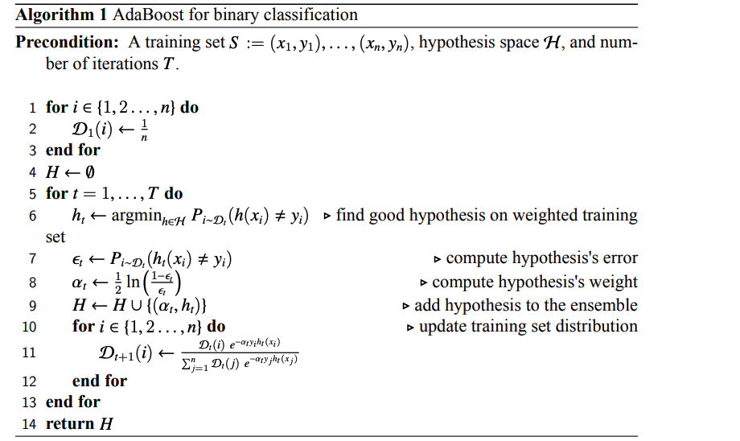

# Ensemble Methods in Machine Learning

## Introduction

Ensemble methods are learning algorithms that construct a set of classifiers and then classify new data points by taking a weighted vote of their predictions. 

Typically, an ensemble is constructed in two steps. First, a number of base learners are produced, which can be generated in a **parallel** or a **sequential** fashion. Then, the base learners are combined to use, where among the most popular combination schemes are `majority vote` for classification and `weighted average` for regression.

There are many effective ensemble methods. I will explain the two common ensemble methods: `Boosting` and `Bagging`.

## Bagging

Bagging trains a number of base learners in parallel. Each base learner is trained on a different bootstrap sample by calling a base learning algorithm. The bootstrap sample is obtained by subsampling the training dataset with replacement, where the size of a sample is as the same as that of the training dataset. 

After obtaining the base learners, the bagging method combines them by majority voting or weighted averaging to get the final predictions. The pseudocode for binary classification with bagging method is shown below:

[Image source](https://cs.nju.edu.cn/zhouzh/zhouzh.files/publication/springerEBR09.pdf)

### Examples of Bagging:

* Random Forest

### Pros & Cons of Bagging:

Pros:

* Ease of implementation
* Reduction of variance

Cons:

* Loss of interpretability
* Computationally expensive
* Less flexible

## Boosting

Boosting is an ensemble method that attempts to build a strong classifier from a set of weak classifiers. First, one model is built from the training data. Then the second model is built which tries to correct the errors present in the first model. This procedure is continued and models are added until either the complete training dataset is predicted correctly or the maximum number of models is added.

### Types of Boosting Method:

#### Adaptive Boosting / AdaBoost

AdaBoost was came up by Yoav Freund and Robert Schapire. This method operates iteratively, identifying misclassified data points and adjusting their weights to minimize the training error. The model continues optimizing in a sequential fashion until it yields the strongest predictor.

For example, let's assume we are given a dataset $S:=\left(x_1, y_1\right),\left(x_2, y_2\right), \ldots,\left(x_n, y_n\right)$ where $\forall i, y_i \in\{-1,1\}$ and a pool of hypothesis functions $H$ from which we are to pick $T$ hypothesis in order to form an ensemble $H_T$ and make a decision using the individual hypothesis $h_1, h_2, ..., h_T$ in the ensemble as follows:

$$
\begin{aligned}
H_T(x)=\sum_{i=1}^T \alpha_i h_i(x) = H_{T-1}(x) + \alpha_T h_T(x)\\
H_0(x) = 0
\end{aligned}
$$

The idea behind AdaBoost algorithm is that the $t^{th}$ hypothesis will correct for the errors that the first $t-1$ hypotheses make on the training set. More specifically, after we select the first $t-1$ hypotheses, we determine which instances in $S$ our $t-1$ hypotheses perform poorly on and make sure that the $t^{th}$ hypothesis performs well on these instances. The pseudocode for AdaBoost is described as follows:

First, we initialize a training set distribution. At each iteration $1,2, ..., T$ of the AdaBoost algorithm, we define a probability distribution $D$ over the training instances in $S$. At the onset of the algorithm, we set $D_1$ to be the uniform distribution over the instances. That is:

$$
\begin{aligned}
\forall i \in\{1,2, \ldots, n\}, \mathcal{D}_1(i):=\frac{1}{n}
\end{aligned}
$$

where $n$ is the size of $S$. 

Secondly, we find a hypothesis to add to the ensemble. At the $i^{th}$ iteration, we search for a new hypothesis, $h_t$, that performs well on $S$ assuming that instances are drawn from $D_t$. By performing well, we mean that $h_t$ should have a low expected 0-1 loss on S under $D_t$. That is:

$$
\begin{aligned}
h_t:=\underset{h \in \mathcal{H}}{\operatorname{argmin}} E_{i \sim \mathcal{D}_t}\left[\ell_{0-1}\left(h, x_i, y_i\right)\right] = \operatorname{argmin} P_{i \sim \mathcal{D}_t}\left(y_i \neq h\left(x_i\right)\right)
\end{aligned}
$$

We call this expected loss the weighted loss because the 0-1 loss is not computed on the instances in the training set directly, but rather on the weighted instances in the training set.

Thirdly, we assign the new hypothesis a weight. Once we compute $h_t$, we assign $h_t$ a weight $\alpha_t$ based on its performance. More specifically, we give it the weight:

$$
\begin{aligned}
\alpha_t:=\frac{1}{2} \ln \left(\frac{1-\epsilon_t}{\epsilon_t}\right)
\end{aligned}
$$

where 

$$
\begin{aligned}
\epsilon_t:=P_{i \sim D_t}\left(y_i \neq h_t\left(x_i\right)\right)
\end{aligned}
$$

The higher the $\epsilon_t$, the smaller the weight, and the less the hypothesis $h_t$ contributes to the ensemble.

Fourthly, we recompute the training set distribution. Once the new hypothesis is added to the ensemble, we recompute the training set distribution to assign each instance a probability proportional to how well the current ensemble $H_t$ performs on the training set. We compute $D_{t+1}$ as follows:

$$
\begin{aligned}
\mathcal{D}_{t+1}(i):=\frac{\mathcal{D}_t(i) e^{-\alpha_t y_i h_t\left(x_i\right)}}{\sum_{j=1}^n \mathcal{D}_t(j) e^{-\alpha_t y_j h_t\left(x_j\right)}}
\end{aligned}
$$

Lastly, repeat step 2 through 4 for T-1 more iterations. 

#### Gradient Boosting

Gradient boosting re-defines boosting as a numerical optimization problem where the objective is to minimize the loss function of the model by adding weak learners using gradient descent.

Intuitively, gradient boosting is a stage-wise additive model that generates learners during the learning process. The contribution of the weak learner to the ensemble is based on the gradient descent optimization process.

Different from AdaBoost, Gradient Boosting method does not change the sample distribution as weak learners train on remaining errors of a strong learner (pseudo-residual). By training on the residuals of the model, this is an alternative means to give more importance to misclassified observations. 

The algorithm is explained as follows:

First, we initialize the model with a constant value by minimizing the loss function:

$$
\begin{aligned}
    F_0(x)=\underset{\rho}{\arg \min } \sum_{i=1}^n L\left(y_i, b_0\right)
\end{aligned}
$$

where:

* $b_0$ is the prediction of the model which minimize the loss function at 0th iteration
* For the squared error loss, it works out to be the average over all training samples
* For the least absolute deviation loss, it works out to be the median over all training samples
  
Secondly, for $m=1$ to $M$:

* Compute $r_{i m}=-\left[\frac{\partial L\left(y_i, F_{m-1}\left(x_i\right)\right)}{\partial F_{m-1}\left(x_i\right)}\right]$ for $i=1, \cdots, n$, where $r_{im}$ is the derivative of the loss function w.r.t. F(x) from the last iteration. For the squared error, this works out to be the residual. It's also called `pseudo-residual` because it acts like the residual and it is the residual for the squared loss.
* Fit a base learner(e.g.,decision tree) $h_m(x)$ to pseudo-residuals, i.e., train it using the training set $\{(x_i, r_{im})\}_{i=1}^n$.
* Compute multiplier $\gamma_m$ by solving the following one-dimensional optimization problem:

$$
\begin{aligned}
\gamma_m=\underset{\gamma}{\arg \min } \sum_{i=1}^n L\left(y_i, F_{m-1}\left(x_i\right)+\gamma h_m\left(x_i\right)\right)
\end{aligned}
$$

* Update the model:
  
$$
\begin{aligned}
F_m(x)=F_{m-1}(x)+\gamma_m h_m(x)
\end{aligned}
$$

Loss function families:

For continuous response:

* Square loss
* Laplace loss
* Huber loss
* Quantile loss
  
For categorical response:

* Binomial loss
* Adaboost loss
* Logistic loss
* Square loss

#### Difference Between AdaBoost and GBM
| AdaBoost| GBM |
| - | - |
|Focus on training upon misclassified observations. Alters the distribution of the training dataset to increase weights on samples that are difficult to classify| Trains learners based upon minimizing the loss function of a learner (e.g., training on the residuals of the model)|
|The final prediction is based on a majority vote of the weak learners' predictions weighted by their individual accuracy|All the learners have equal weights in the case of GBM. The weight is usually set as the learning rate which is small in magnitude|

#### XGBoost

Mathematical details: https://blog.mattbowers.dev/how-to-understand-xgboost

XGBoost stands for Extreme Gradient Boosting. It's a parallelized and carefully optimized version of the gradient boosting algorithm. Parallelizing the whole boosting process hugely imrpoves the training time.

Some important features of XGBoost:

* Parallelization: the model is implemented to train with multiple CPU cores.
* Regularization: XGBoost includes different regularization penalties to avoid overfitting.
* Non-linearity: XGBoost can detect and learn from non-linear data patterns.
* Scalability: XGBoost can run distributed thanks to distributed servers and clusters like Hadoop and Spark, so you can process enormous amount of data.